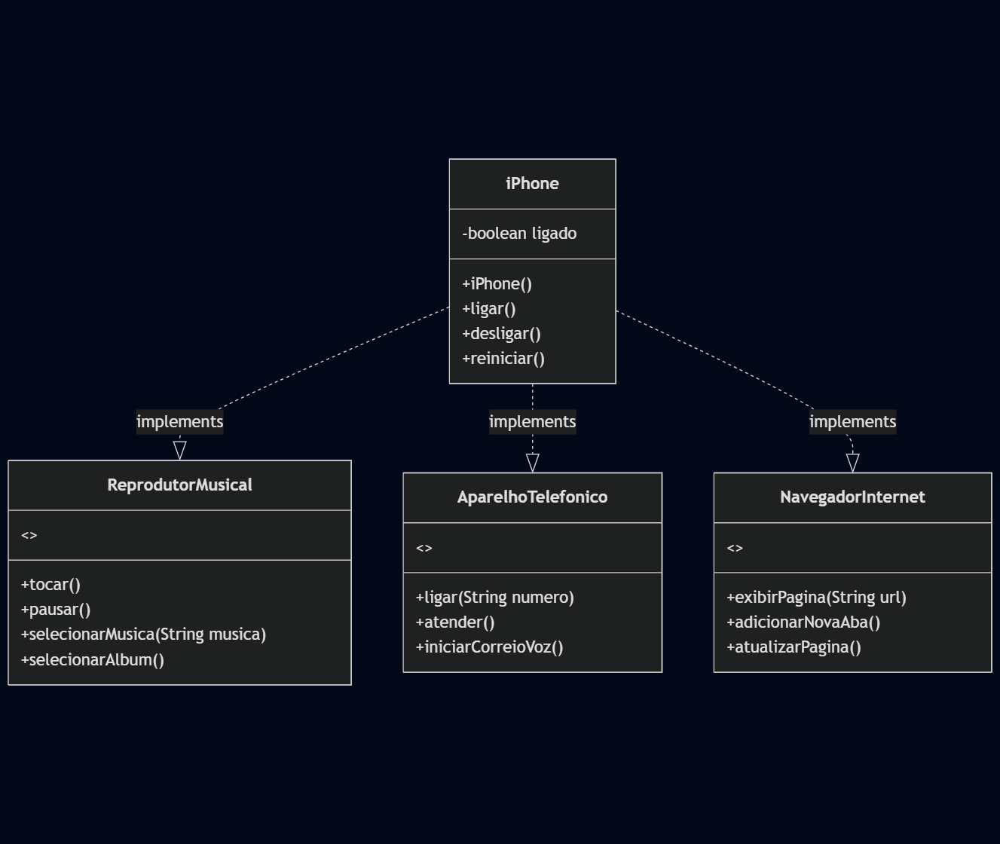
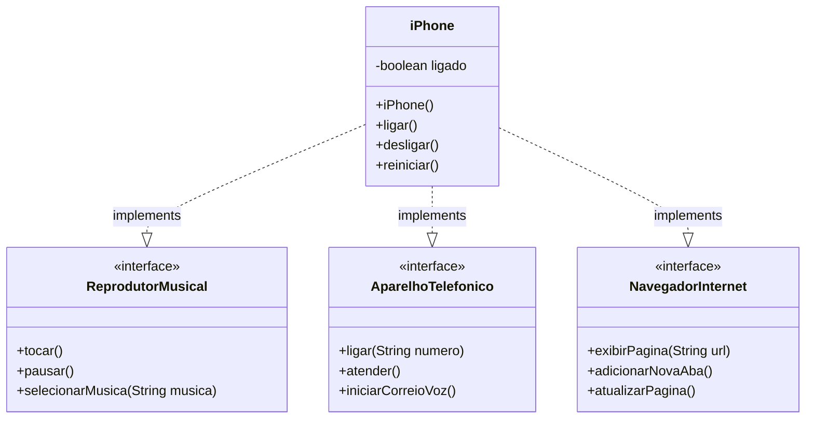

# Desafio POO - iPhone

Este projeto representa a modelagem UML do iPhone, com foco em suas funcionalidades como Reprodutor Musical, Aparelho Telefônico e Navegador de Internet, conforme desafio proposto na plataforma DIO.

## Diagrama UML

### Versão Visual

### Código Mermaid

